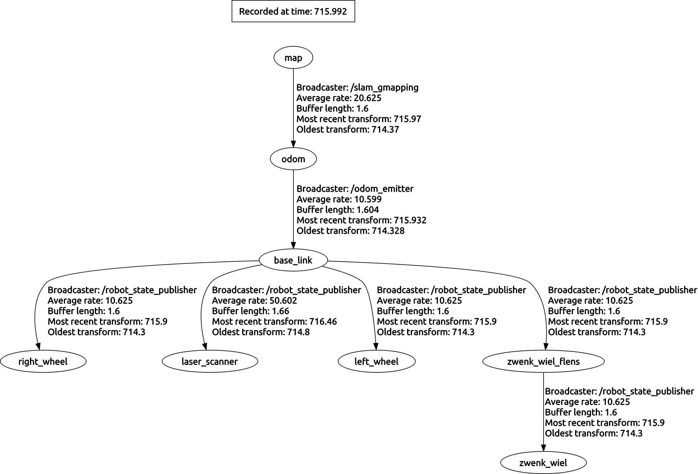

This package controls the x80sv robot

To launch the gmapping, move_base and costmap run:

  roslaunch x80sv_nerves intelligence.launch

This constructs the correct TF sequence:

Then launch rviz:

  $ rosrun rviz rviz

.. image:: rviz_gmapping.png
