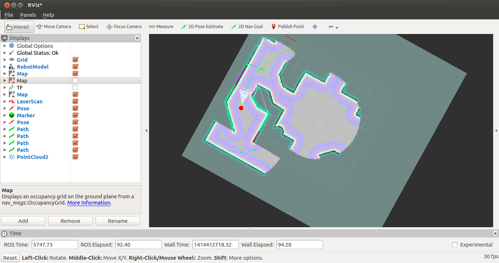

This package contains the required files to launch the ros package move_base on the x80sv robot.

Make sure you have the following dependencies:

- ros-indigo-dwa-local-planner
- ros-indigo-controller-manager
- ros-indigo-move-base

To launch this package, first launch the x80sv (either simulated or real variant).

.. code:: bash

  $ roslaunch x80sv_bringup sim_world.launch

Then launch the x80sv_navigation.launch

.. code:: bash

    $ roslaunch x80sv_navigation x80sv_navigation.launch

Now you can issue a nav goal in rviz.

Or you can use the random drive around script by launching the all in one launch file:

.. code:: base
    
    $ roslaunch x80sv_navigation explore_sim_world.launch

Then launch rviz and add several components to visualize the robot state.

