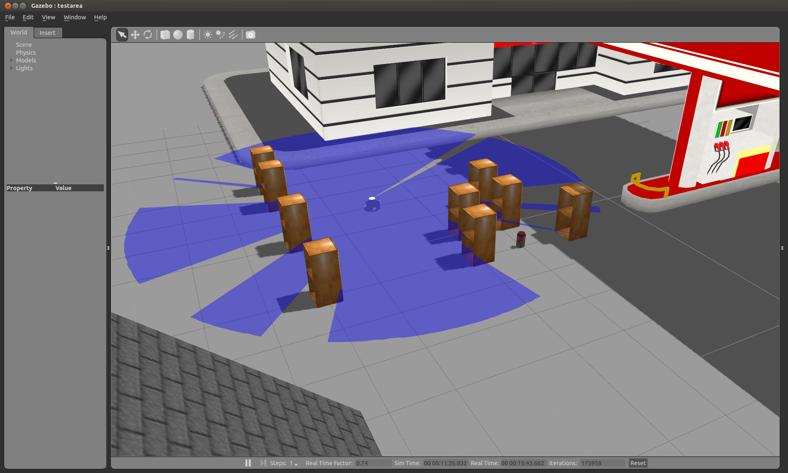
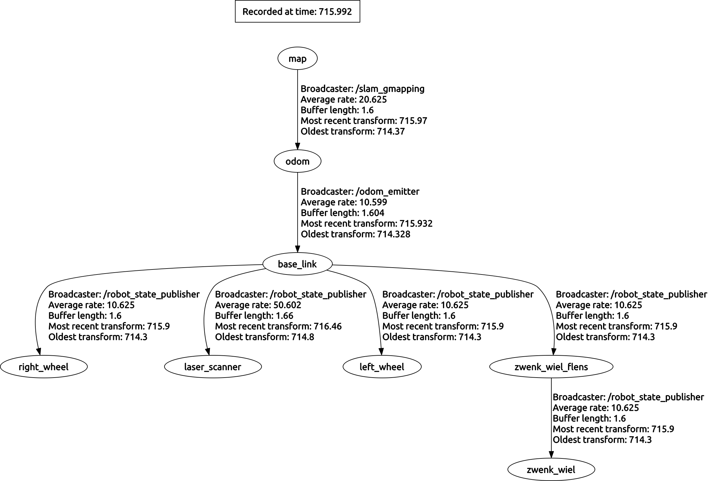
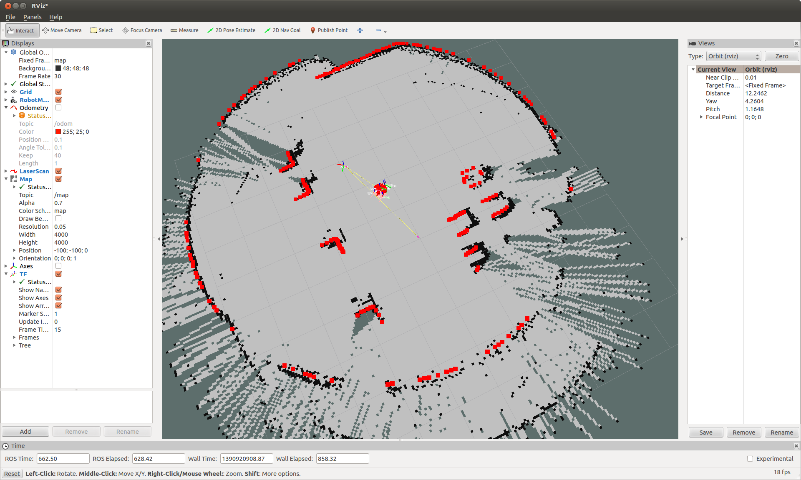

This package controls the x80sv robot

To launch the simulation of the x80sv run:

  roslaunch groundcontrol_gui simulation.launch

You will then see this:

To launch the gmapping run:

  roslaunch groundcontrol_gui intelligence.launch

This constructs the correct TF sequence:

Then launch rviz:

