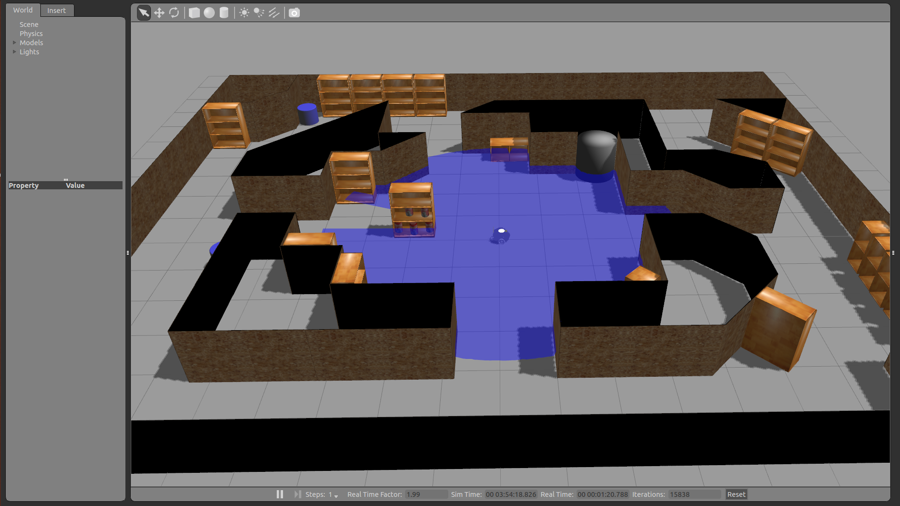

Simulation of the x80sv
=======================

This ROS package contains simulation scenarios for the x80sv robot. The launch file will load an
worldfile, load controllers and launch a file that listens to the /cmd_vel topic.

To launch the simulation of the x80sv run:

  roslaunch x80sv_bringup sim_world.launch
  
with the argument "worldfile:=[WORLDFILE_NAME].world", it is possible to change the file that is loaded.
the argument "use_gui:= [TRUE / FALSE]" can be used to run the simulation with GUI, or withoud it (headless).

You will then see this:

Offline models
--------------

For offline usage of the downloaded object models, the local model database should be used by gazebo.

This can be done by referencting the local gazebo model path database, in this case:

	$ export GAZEBO_MODEL_PATH=~/catkin_ws/src/x80sv/x80sv_simulation/models/

Models can be downloaded from the Gazebo model database bitbucket at https://bitbucket.org/osrf/gazebo_models
